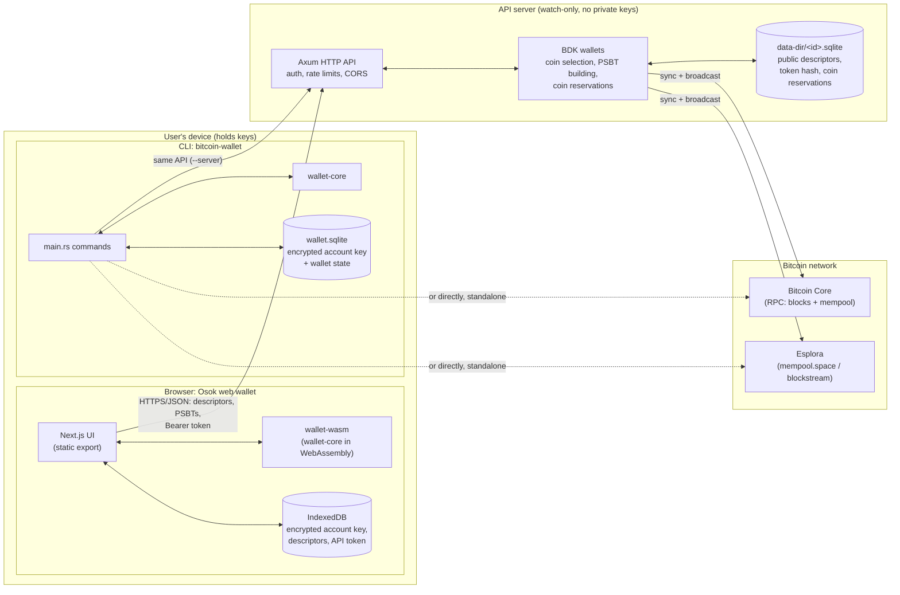
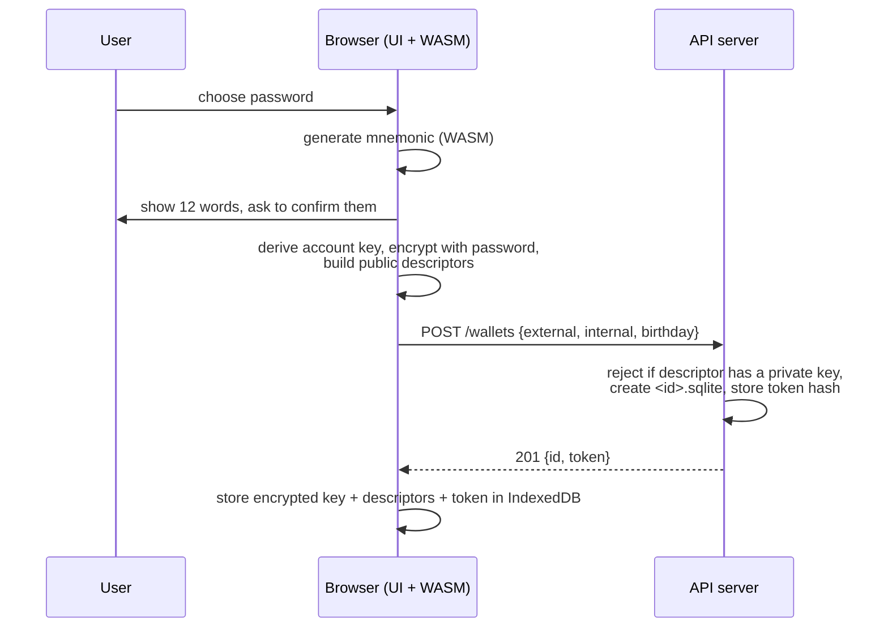
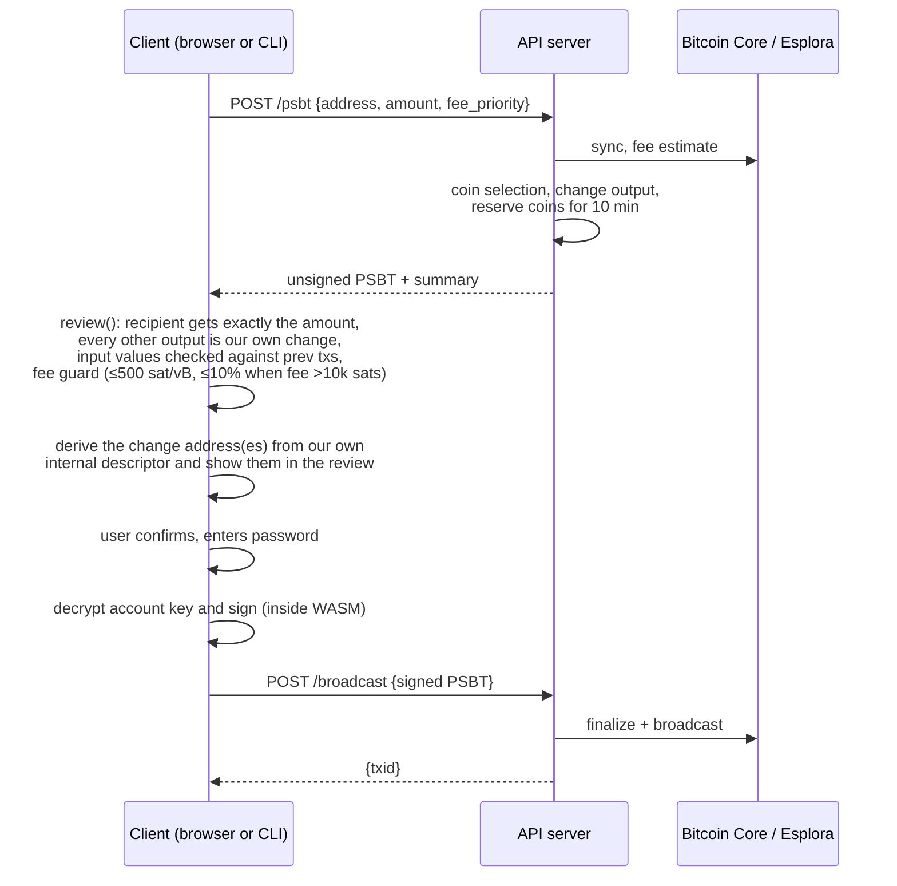
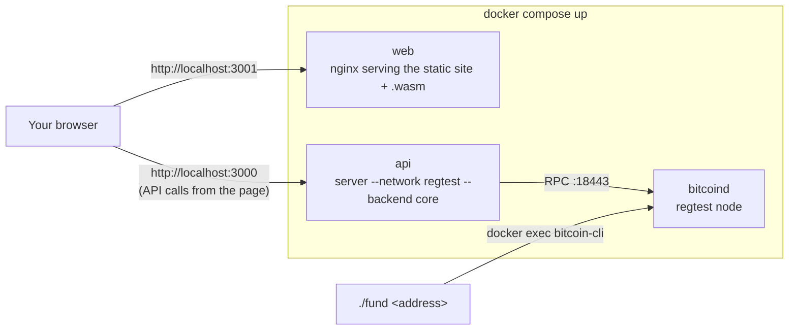

# Architecture

This document explains what the project is, why it's built the way it is, and how the pieces
fit together. For commands and API details see [README.md](README.md); for tests see
[test.md](test.md).

## The idea

A **non-custodial Bitcoin wallet**: you, not a server, hold the keys. The project is split so
that the part that talks to the blockchain (and could be hosted by someone else) never sees a
private key, and the part that holds keys never has to trust that server.

Three clients share one Rust core:

- **CLI** (`cargo run -- ...`): holds keys, can work alone against Bitcoin Core or Esplora.
- **Web wallet "Osok"** (`web/`): a static Next.js site; keys live in the browser, and all key
  handling runs as Rust compiled to WebAssembly.
- **Watch-only API server** (`src/bin/server.rs`): knows each wallet's *public* descriptors, so
  it can sync, show balances and history, hand out addresses and build unsigned transactions.
  It cannot spend.

The core principle is **"verify, don't trust"**: the server builds a transaction (a PSBT), but
the client re-checks every output and the fee with its own keys before it signs.

## System architecture



What crosses each boundary:

| From → to | What is sent | Never sent |
|---|---|---|
| Client → API | public descriptors (`tpub`), recipient + amount, signed PSBTs, API token | mnemonic, private keys, password |
| API → client | addresses, balances, history (with times), transaction details (inputs/outputs), **unsigned** PSBTs, original tx for bumps | — |
| API → chain | block/mempool queries, finalized transactions | — |

## Code layout

```
bitcoin-wallet/                 Cargo workspace
├── wallet-core/                Pure wallet logic, no I/O. Shared by CLI, server and browser.
│   ├── keys.rs                 BIP39 mnemonic → account key m/84'/1'/n' → descriptors
│   ├── crypto.rs               Argon2id + XChaCha20-Poly1305 encryption of the account key
│   ├── review.rs               review / review_bump / check_fee: verify a server's PSBT,
│   │                           and report which of our change addresses get the change
│   ├── sign.rs                 sign a PSBT with the account key
│   └── ownership.rs            sign/verify a server challenge (API token recovery)
├── wallet-wasm/                Thin wasm-bindgen wrapper exposing wallet-core to JavaScript
├── src/                        The `bitcoin-wallet` crate (native only)
│   ├── main.rs                 CLI commands (create, restore, send, bump, ...)
│   ├── bin/server.rs           Watch-only Axum API server
│   ├── chain.rs                Chain backends: Bitcoin Core RPC or Esplora; sync
│   ├── send.rs                 build → review → sign → finalize → broadcast
│   ├── history.rs              transaction list (with times), one transaction's details
│   │                           (inputs/outputs marked receive / change / external), addresses
│   ├── secret.rs               encrypted account key storage in SQLite
│   ├── api.rs / client.rs      JSON types and the CLI's HTTP client for the server
│   └── lib.rs                  shared helpers (network parsing, wallet id, loading)
├── tests/regtest.rs            End-to-end: real server + regtest node, full send
├── web/                        Osok: Next.js + TypeScript + Tailwind, static export
│   ├── src/app/                screens: setup, dashboard, send, transaction detail,
│   │                           speed-up, password card
│   ├── src/lib/                api.ts (server), wallet.ts (WASM), store.ts (IndexedDB),
│   │                           accounts.ts (multi-account), format.ts (exact sat ↔ BTC)
│   └── e2e/                    Playwright browser tests
├── docker-compose.yml          bitcoind + api + web, one command
├── Dockerfile.server           builds the API server image
├── Dockerfile.web              Rust → WASM → Next.js static site → nginx
└── fund                        regtest faucet script
```

Why `wallet-core` is separate: the security checks (PSBT review, fee guard, signing) are the
part that must be correct. Writing them once in Rust and compiling the same code to
WebAssembly means the browser doesn't carry a second, TypeScript implementation that could
drift from the CLI's.

## Keys and storage

```
12-word mnemonic (BIP39)
   └── master key  (fingerprint)
         └── m/84'/1'/n'   account key  ← the only secret that is stored, encrypted
               ├── /0/*    receive addresses  (external descriptor, public)
               └── /1/*    change addresses   (internal descriptor, public)
```

- **BIP84 native SegWit** (`wpkh`). Coin type `1'` (test networks); mainnet is refused for now.
- **Only the account key is stored**, never the mnemonic. It's encrypted with the user's
  password (Argon2id key derivation + XChaCha20-Poly1305) and decrypted only while signing.
  A leaked file plus password exposes one account, not the whole seed.
- **Multiple accounts** in the web wallet are `m/84'/1'/0'`, `/1'`, `/2'`... of the same seed;
  each is registered with the server as its own wallet.
- **Wallet id** is derived from the public descriptors, so the same wallet always gets the same
  id on any server.
- **Birthday**: a new wallet records the current block height so the first Core sync doesn't
  scan from genesis.

| Where | Holds |
|---|---|
| CLI `wallet.sqlite` | encrypted account key + BDK wallet state |
| Browser IndexedDB (`wallet:<network>`) | encrypted account key, descriptors, API token, account list |
| Server `data-dir/<id>.sqlite` | public descriptors, BDK state, SHA-256 of the API token, coin reservations |

## Main flows

### Create a wallet and register it



### Send (the core security flow)



The server can lie about anything, and the client still won't sign a transaction that pays
someone else, hides a large fee, or uses a non-`SIGHASH_ALL` signature.

**Where the change goes.** A transaction usually has a change output: the part of the spent
coins that comes back to us. The server picks the change address, so the client has to prove
it's really ours. `review()` doesn't just check that the PSBT *claims* an output is change; it
reads the derivation path the PSBT gives for that output, re-derives the script from our own
internal (`/1/*`) descriptor at that index and requires an exact match. It returns those
indexes (`Review.change_indexes`), and the browser turns each into an address with
`addressAt(internal, index)`. The review sheet's "Transaction details" shows the recipient, the
amount, the fee, the change amount and **"Change address #n"** with the full address. What the
user sees there is therefore computed locally from their own keys, not copied from the server.

```
wallet-core review()  ──change_indexes──▶  wallet-wasm (SendReview / BumpReview)
                                                  │ changeIndexes
                                                  ▼
                       web/src/lib/wallet.ts: addressAt(wallet.internal, i)
                                                  │ changeAddresses [{index, address}]
                                                  ▼
                       Send review sheet / Speed up review: "Change address #n  tb1q…"
```

### Speed up (RBF fee bump)

Speed up lives on the transaction detail screen (below) and only appears while the
transaction is unconfirmed. The server builds a replacement transaction and also returns the
**original** transaction. The client checks the original's txid matches the one it asked to
bump, then `review_bump` verifies the replacement spends every original input, pays every
original payment unchanged, sends the rest to its own change, and pays a higher fee. Like the
send review, it shows the old and new fee, the change address(es) derived in the browser,
and how many coins (inputs) it spends.

### View a transaction (activity list and detail screen)

The activity list shows each transaction's amount, status and **date**. Tapping one opens a
detail screen backed by `GET /wallets/{id}/transactions/{txid}`:

| Field | Meaning |
|---|---|
| `time` | Unix seconds: the block's time once confirmed, when the node first saw it in the mempool before that |
| `confirmations`, `block_height` | how deep it is; both empty while unconfirmed |
| `fee_sat`, `fee_rate_sat_vb`, `vsize` | fee and size; the fee only for transactions this wallet paid |
| `rbf` | whether it signals replace-by-fee (BIP125), i.e. whether it can be sped up |
| `inputs[]`, `outputs[]` | address, value and `owner`: `receive` or `change` (ours) or `external` |

The server decides `owner` with BDK's `derivation_of_spk`: a script that matches one of our
descriptors is ours (`/0/*` = receive, `/1/*` = change), anything else is external. This
screen is **for information only**. It comes from the server and isn't re-verified, and that's
safe because nothing on it gets signed. Anything the user acts on, such as Speed up, goes
through the WASM review again.

### API token recovery

Registration is one-shot (a second one gets `409`, since descriptors aren't secret). If a
client loses its token, it asks for a one-time challenge (`/challenge`), signs it with the key
of its first receive address (`wallet_core::ownership`), and the server verifies that against
the registered descriptor before issuing a new token (`/token`) and revoking the old one.

## Server internals

- **Axum** HTTP server; each wallet is a BDK `PersistedWallet` in its own SQLite file, opened
  lazily and kept in memory behind a mutex.
- **Auth**: per-wallet bearer token; only its SHA-256 hash is stored.
- **Wallet ids** must be exactly 16 hex chars (they become file names, so this blocks path
  traversal).
- **Coin reservations**: coins used in a handed-out PSBT are reserved for 10 minutes so two
  sends in a row don't pick the same coins. They're saved in the wallet's SQLite file
  (`coin_reservation`: outpoint + expiry in unix seconds) and loaded back when the wallet is
  opened, so a restart between `/psbt` and `/broadcast` doesn't free them. A loaded expiry
  is capped at 10 minutes from now, in case the system clock jumped backwards.
- **Sync throttling**: `--sync-interval-secs` (default 30) avoids re-syncing on every request
  and keeps public Esplora rate limits happy.
- **Rate limits** per IP: 60 requests/minute overall, 5 registrations/hour.
- **CORS** allows only the web wallet's origins.
- **Backends** (`chain.rs`): Bitcoin Core RPC (blocks + mempool, uses the birthday) or Esplora
  (address lookups, stop gap 20), with retries on flaky connections (broadcast isn't retried).

## Networks

| Network | Typical backend | Use |
|---|---|---|
| regtest (default) | local Bitcoin Core in Docker | development, tests, the Docker demo |
| testnet4 | Esplora (mempool.space) | real test network |
| testnet / signet | Esplora | alternatives |
| mainnet | — | refused for now |

A wallet only opens on the network it was created for, and the server checks the chain it's
connected to matches `--network`.

## Deployment: the Docker demo



- `bitcoind` must be healthy (RPC answers) before `api` starts.
- `web` is built in three stages: Rust → WASM (`wasm-pack`), Next.js static export, nginx.
  The API URL is baked in at build time because the page calls the API from the browser.
- Ports bind to `127.0.0.1` only; chain data and server wallets live in Docker volumes.

## Security model in one list

1. The server stores **public descriptors only** and rejects private ones; a compromised server
   can see balances but can't spend.
2. Clients **review every PSBT** (and every fee bump) before signing.
3. A **high-fee guard** blocks fees that look like mistakes or attacks unless explicitly allowed.
4. Every receive address from the server is **re-derived in the browser** and refused if it
   differs. Change addresses in a PSBT are matched against our own descriptor too, and the
   address the user sees in the review is derived in the browser.
5. Keys are **encrypted at rest**, decrypted only to sign; in the browser this happens inside
   WASM, so the key never reaches JavaScript.
6. The web wallet is a **static site**: there's no web server that could ever see a secret.

Known gaps: no TLS yet (keep the server on localhost), rate limits read the direct IP (not
`X-Forwarded-For`), and rate-limit counts are lost on restart.

## Testing

| Layer | Command | Covers |
|---|---|---|
| Unit | `cargo test --workspace` | encryption, descriptor checks, PSBT attack cases, rate limiter |
| End-to-end | `cargo test --test regtest -- --ignored` | real server + regtest node, full non-custodial send |
| Browser | `cd web && npm run e2e` | Playwright drives the real web wallet against a real server: create/import, accounts, receive, send (incl. the change address shown in the review), Max, speed up from the detail screen |

## Recent changes

| Commit | Change | Why it matters |
|---|---|---|
| `0ce1e18` | Transaction detail screen: time, fee rate, size, RBF flag, inputs and outputs marked receive / change / external. Speed up moved from the list row onto this screen. | Users can see exactly where coins came from and went. Speed up sits next to the fee it changes. |
| `3d5cce7` | Transactions carry a time (block time, or first seen in the mempool), shown as dates in the activity list. | History reads like a statement instead of a list of txids. |
| `587ce88` | The PSBT review reports which of our change addresses get the change; the browser derives and shows them in the Send and Speed up reviews (Speed up also shows inputs). | Before signing, the user sees where *every* satoshi goes, including the part coming back, and those addresses come from their own keys rather than from the server. |
| `007d3db` | Coin reservations are saved in each wallet's SQLite file instead of only in memory. | A server restart between building a PSBT and broadcasting it no longer lets a second PSBT reuse the same coins (which would have been a double-spend). |
